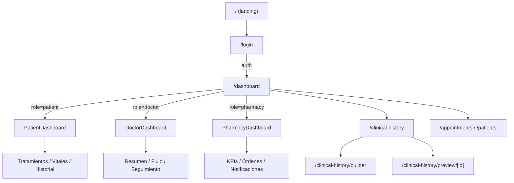

# 🏗️ LUCA Health OS — Arquitectura de proyecto

> Generado: 2026-06-07

## 📁 Estructura completa

```
src/
├── 🏠 app/                              # Next.js App Router (rutas y layouts)
│   ├── (main)/                          # Páginas públicas (landing)
│   │   ├── Welcome.tsx
│   │   ├── AboutUs.tsx
│   │   ├── ContactUs.tsx
│   │   └── contacto/page.tsx
│   ├── api/                             # API routes
│   │   └── clinical-history-schema/
│   ├── clinical-history/                # Builder de historias clínicas
│   │   ├── page.tsx                     # Lista de plantillas
│   │   ├── builder/page.tsx             # Drag & Drop builder
│   │   └── preview/[id]/page.tsx        # Vista previa de formulario
│   ├── dashboard/                       # Dashboard unificado (role-based)
│   │   ├── layout.tsx                   # Shell: Sidebar + MobileDrawer + BottomNav
│   │   ├── page.tsx                     # Router: patient | doctor | pharmacy
│   │   └── drawer-context.tsx
│   ├── login/page.tsx                   # Login / Register
│   ├── layout.tsx                       # Root layout
│   ├── lib/                             # Utilidades de app
│   │   ├── animations.ts
│   │   ├── utils.ts
│   │   └── validations.ts
│   └── page.tsx                         # Landing page
│
├── 🧩 components/                       # Componentes compartidos
│   ├── ui/                              # shadcn/ui primitives
│   │   ├── Container.tsx
│   │   ├── avatar / badge / button / card / command
│   │   ├── dialog / dropdown-menu / popover / sheet
│   │   ├── input / input-group / textarea
│   │   ├── separator / tabs
│   ├── SmartHeader/                     # Header inteligente
│   │   ├── SmartHeader.tsx
│   │   ├── MobileHeader.tsx
│   │   ├── HeaderContext.tsx
│   │   ├── NotificationBell.tsx
│   │   ├── SearchCommand.tsx
│   │   └── UserProfile.tsx
│   ├── pharmako-login/                  # Componentes de auth (marca Pharmako)
│   │   ├── AuthContainer / AuthTabs / AuthRegisterContent
│   │   ├── LoginForm / LoginButton / RememberSession
│   │   ├── PharmakoInput / PharmiWorkspace
│   │   └── index.ts
│   ├── Sidebar.tsx
│   └── Providers.tsx
│
├── 🚀 features/                         # Feature-based architecture
│   ├── auth/                            # Registro de usuarios
│   │   ├── components/
│   │   │   ├── TypeProfile.tsx
│   │   │   ├── FormRegisterPatient.tsx
│   │   │   ├── FormRegisterMedical.tsx
│   │   │   └── FormRegisterInstitution.tsx
│   │   └── index.ts
│   │
│   ├── patient-dashboard/               # Dashboard del paciente ✅ SDD
│   │   ├── types/index.ts
│   │   ├── hooks/                       # 7 hooks mock (TanStack-ready)
│   │   ├── components/                  # 9 componentes Notion-isomatic
│   │   │   ├── PatientDashboard.tsx     # Composición root
│   │   │   ├── PatientGreeting / PatientKpiCard / PatientKpiCards
│   │   │   ├── NextAppointmentCard / PatientQuickActions
│   │   │   ├── ActiveTreatment / VitalSigns / ConsultationHistory
│   │   └── index.ts
│   │
│   ├── doctor-dashboard/                # Dashboard del médico ✅ SDD
│   │   ├── types/index.ts
│   │   ├── hooks/                       # 5 hooks
│   │   ├── components/                  # 18 componentes (3 vistas workflow)
│   │   │   ├── DoctorDashboard.tsx      # Composición root
│   │   │   ├── DashboardSwitcher / ResumenView / PatientFlowView / FollowUpView
│   │   │   ├── KpiCard / KpiCards / NextPatientCard / ActionChecklist
│   │   │   ├── DailyAgenda / AgendaItem / QuickActions / QuickActionButton
│   │   │   ├── CriticalNotifications / NotificationAlert / StatusBadge
│   │   │   ├── MobileDrawer / BottomNav
│   │   └── index.ts
│   │
│   ├── pharmacy-dashboard/              # Dashboard de farmacia ✅ SDD
│   │   ├── types/index.ts
│   │   ├── hooks/                       # 3 hooks
│   │   ├── components/                  # 11 componentes
│   │   │   ├── PharmacyDashboard.tsx    # Composición root
│   │   │   ├── PharmacyHeader / KpiCard / KpiCards
│   │   │   ├── OrderAgenda / OrderItem / StatusBadge
│   │   │   ├── QuickActions / QuickActionButton
│   │   │   ├── CriticalNotifications / NotificationAlert
│   │   └── index.ts
│   │
│   ├── clinical-history-builder/        # Builder drag & drop de HC
│   │   ├── types.ts
│   │   ├── schemas/
│   │   ├── store/                       # Zustand store
│   │   ├── hooks/                       # DnD + keyboard shortcuts
│   │   ├── components/                  # 12 componentes
│   │   └── index.ts
│   │
│   ├── appointments/                    # CRUD de citas
│   │   ├── components/
│   │   ├── schemas.ts
│   │   └── index.ts
│   │
│   ├── patients/                        # CRUD de pacientes
│   │   ├── components/
│   │   ├── schemas.ts
│   │   └── index.ts
│   │
│   ├── consultations/                   # Consultas médicas
│   │   ├── components/                  # 6 componentes
│   │   ├── schemas.ts
│   │   └── index.ts
│   │
│   └── medications/                     # Medicamentos
│       ├── components/                  # 3 componentes
│       ├── schemas.ts
│       └── index.ts
│
├── 🪝 hooks/                            # Hooks globales
│   ├── useMediaQuery.ts
│   ├── useScrollDirection.ts
│   └── useKeyboardShortcut.ts
│
├── 📚 lib/                              # Utilidades y API clients
│   ├── utils.ts                         # cn() helper
│   └── api/clinical-history/            # API hooks (TanStack Query)
│
├── 🗄️ store/                            # Zustand global stores
│   └── auth.ts                          # useAuthStore (role, name, token)
│
├── ⚙️ config/
│   └── navigation.ts
│
└── 🛡️ proxy.ts                          # Auth middleware (cookie-based)
```

## 🔀 Flujo de rutas



## 🎨 Design tokens

| Token | Uso |
|-------|-----|
| `pharmako-care` `#23DCE1` | Íconos, acentos |
| `pharmako-care-light` `#EBFAF3` | Fondos de íconos |
| `blue-700` | Botones primarios, links |
| `slate-900` | Texto principal |
| `slate-500` | Texto secundario |
| `slate-200` | Bordes de tarjetas |
| `emerald-600` | Éxito, estable, normal |
| `amber-600` | Alertas, warnings |
| `white` | Fondos de tarjetas |
| `slate-50` | Fondo de app |

**Regla estricta:** cero sombras (`shadow-none`), estilo Notion-isomatic.
