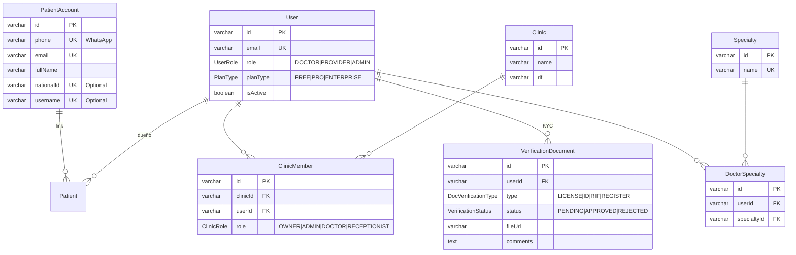
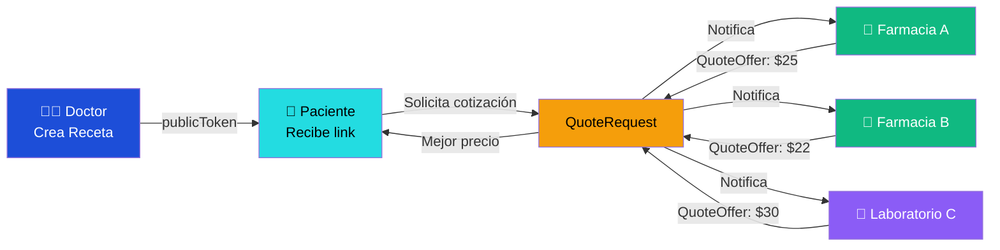
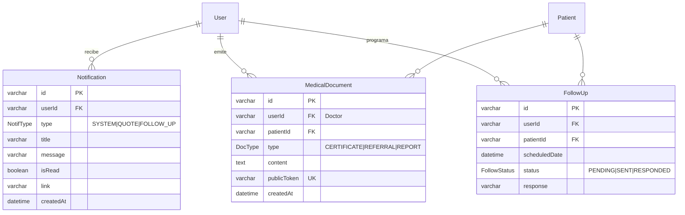
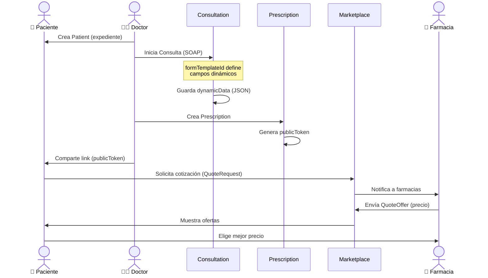
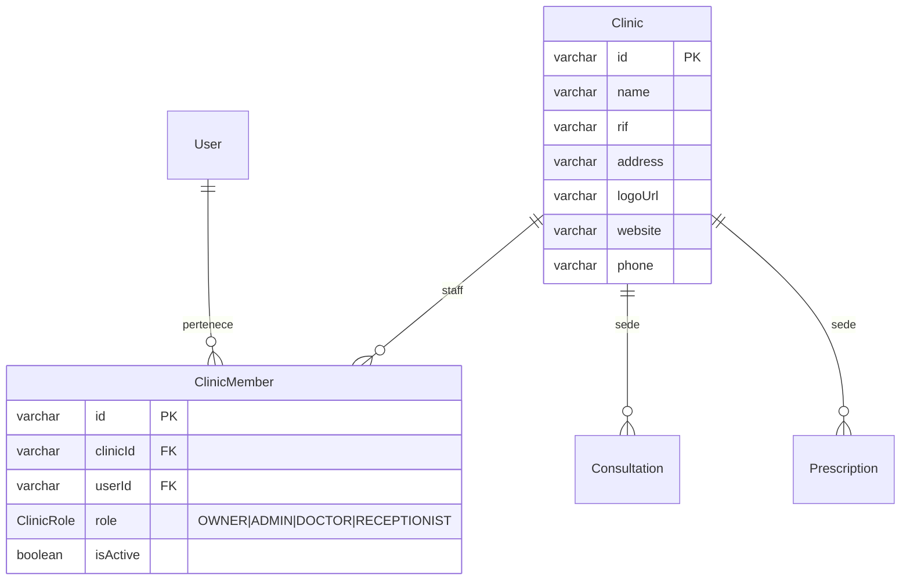
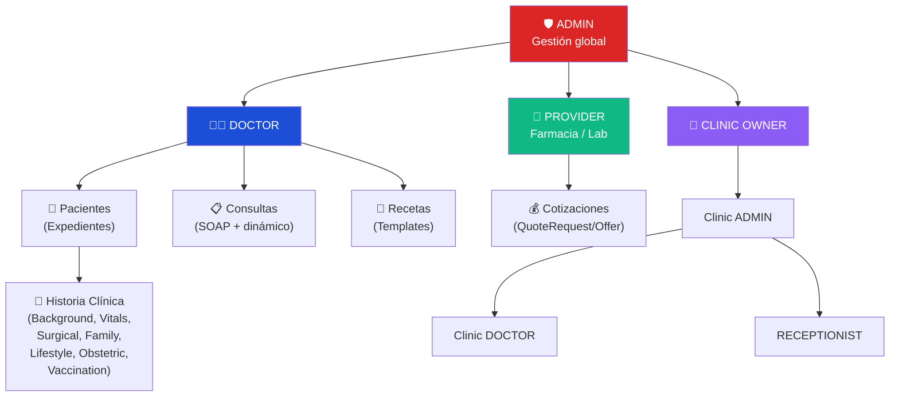

# 🗄️ LUCA Health OS — Diagramas de Base de Datos

> Generado desde `database.md` — 10 módulos, 27 tablas

---

## 1. Diagrama ER Completo (Master)

```mermaid
erDiagram
    PatientAccount ||--o{ Patient : "patientAccountId"
    User ||--o{ Patient : "userId (dueño)"
    User ||--|| ProviderProfile : "1:1 userId"
    User ||--o{ Consultation : "userId"
    User ||--o{ Prescription : "userId"
    User ||--o{ FormTemplate : "userId (custom)"
    User ||--o{ Notification : "userId"
    User ||--o{ MedicalDocument : "userId"
    User ||--o{ FollowUp : "userId"
    User ||--o{ PrescriptionTemplate : "userId"
    User ||--o{ VerificationDocument : "userId"
    User ||--o{ ClinicMember : "userId"
    User ||--o{ DoctorSpecialty : "userId"
    Specialty ||--o{ DoctorSpecialty : "specialtyId"

    Clinic ||--o{ ClinicMember : "clinicId"
    Clinic ||--o{ Consultation : "clinicId (opcional)"
    Clinic ||--o{ Prescription : "clinicId (opcional)"

    Patient ||--o{ Consultation : "patientId"
    Patient ||--o{ Prescription : "patientId"
    Patient ||--o{ QuoteRequest : "patientId"
    Patient ||--o{ MedicalDocument : "patientId"
    Patient ||--o{ FollowUp : "patientId"
    Patient ||--|| MedicalBackground : "1:1"
    Patient ||--|| Lifestyle : "1:1"
    Patient ||--|| ObstetricHistory : "1:1"
    Patient ||--o{ SurgicalHistory : "patientId"
    Patient ||--o{ FamilyHistory : "patientId"
    Patient ||--o{ Vaccination : "patientId"
    Patient ||--o{ VitalSign : "patientId"

    Consultation ||--|| VitalSign : "1:1 consultationId"
    Consultation ||--|| LabRequest : "1:1 consultationId"
    Consultation ||--|| Prescription : "1:1 consultationId (opcional)"
    Consultation }o--|| FormTemplate : "formTemplateId"

    Prescription ||--o{ PrescriptionItem : "prescriptionId"
    Prescription ||--o{ QuoteRequest : "prescriptionId"

    PrescriptionTemplate ||--o{ TemplateItem : "templateId"

    QuoteRequest ||--o{ QuoteOffer : "quoteRequestId"
    ProviderProfile ||--o{ QuoteOffer : "providerId"

    PatientAccount {
        varchar id PK
        varchar phone UK "WhatsApp global"
        varchar email UK
        varchar passwordHash "Optional"
        varchar fullName
        varchar avatarUrl
        varchar nationalId UK "Optional"
        varchar username UK "Optional"
        timestamp createdAt
    }

    User {
        varchar id PK
        varchar email UK
        varchar passwordHash
        varchar fullName
        varchar phone
        UserRole role "DOCTOR | PROVIDER | ADMIN"
        boolean isActive
        PlanType planType "FREE | PRO | ENTERPRISE"
        varchar logoUrl
        varchar signatureUrl
        timestamp createdAt
        timestamp updatedAt
    }

    Specialty {
        varchar id PK
        varchar name UK
        text description
    }

    DoctorSpecialty {
        varchar id PK
        varchar userId FK
        varchar specialtyId FK
    }

    Patient {
        varchar id PK
        varchar userId FK "Dueño (Doctor)"
        varchar patientAccountId FK "Cuenta Global"
        varchar firstName
        varchar lastName
        varchar nationalId
        datetime birthDate
        Gender gender
        varchar email
        varchar phone
        varchar address
        varchar city
        varchar accessCode UK "Portal paciente"
        datetime lastLogin
        varchar bloodType
        varchar allergies
        varchar chronicConditions
        text privateNotes "Solo doctor"
        timestamp createdAt
        timestamp updatedAt
    }

    Consultation {
        varchar id PK
        varchar userId FK
        varchar patientId FK
        varchar clinicId FK "Opcional"
        varchar formTemplateId FK "Esquema usado"
        datetime date
        varchar reason
        text physicalExam
        varchar diagnosis
        text treatmentPlan
        json dynamicData "Respuestas del form"
    }

    Prescription {
        varchar id PK
        varchar userId FK
        varchar patientId FK
        varchar consultationId FK "1:1 opcional"
        varchar clinicId FK "Opcional"
        datetime date
        datetime expirationDate
        varchar notes
        varchar publicToken UK
        RxStatus status "ACTIVE | CANCELLED | EXPIRED"
    }

    Clinic {
        varchar id PK
        varchar name
        varchar rif
        varchar address
        varchar logoUrl
        varchar website
        varchar phone
        timestamp createdAt
        timestamp updatedAt
    }

    ProviderProfile {
        varchar id PK
        varchar userId FK UK
        ProviderType type "PHARMACY | LABORATORY"
        varchar commercialName
        varchar rif
        varchar address
        varchar city
        varchar state
        varchar phone
        boolean isOpen
        boolean isVerified
    }
```

---

## 2. Módulo de Identidad & Auth



---

## 3. Módulo de Expedientes (CRM Médico)

```mermaid
erDiagram
    Patient {
        varchar id PK
        varchar userId FK "Doctor dueño"
        varchar firstName
        varchar lastName
        varchar nationalId
        datetime birthDate
        Gender gender "MALE|FEMALE|OTHER"
        varchar bloodType
        varchar allergies
        varchar chronicConditions
        text privateNotes "Solo doctor"
    }

    MedicalBackground {
        varchar id PK
        varchar patientId FK UK "1:1"
        boolean hasDiabetes
        boolean hasHypertension
        boolean hasAsthma
        text otherConditions
        text pastHospitalizations
    }

    SurgicalHistory {
        varchar id PK
        varchar patientId FK
        varchar procedure
        datetime date
        varchar hospital
    }

    FamilyHistory {
        varchar id PK
        varchar patientId FK
        varchar condition
        varchar relationship
    }

    Lifestyle {
        varchar id PK
        varchar patientId FK UK "1:1"
        varchar smokingStatus
        varchar alcoholConsumption
        varchar activityLevel
        varchar dietType
    }

    ObstetricHistory {
        varchar id PK
        varchar patientId FK UK "1:1"
        datetime lastPeriodDate
        int pregnancies
        int births
        int cesareans
        int abortions
    }

    Vaccination {
        varchar id PK
        varchar patientId FK
        varchar vaccine
        int doseNumber
        datetime date
    }

    Patient ||--|| MedicalBackground : "1:1"
    Patient ||--|| Lifestyle : "1:1"
    Patient ||--|| ObstetricHistory : "1:1"
    Patient ||--o{ SurgicalHistory : ""
    Patient ||--o{ FamilyHistory : ""
    Patient ||--o{ Vaccination : ""
```

---

## 4. Módulo Clínico (Consultas + Signos + Plantillas)

```mermaid
erDiagram
    FormTemplate {
        varchar id PK
        varchar userId FK "Opcional (custom doctor)"
        varchar specialty "Ej: Cardiología"
        json schemaJson "Array de inputs"
    }

    Consultation {
        varchar id PK
        varchar userId FK
        varchar patientId FK
        varchar clinicId FK "Opcional"
        varchar formTemplateId FK "Esquema usado"
        datetime date
        varchar reason "SOAP: Subjetivo"
        text physicalExam "SOAP: Objetivo"
        varchar diagnosis "SOAP: Análisis"
        text treatmentPlan "SOAP: Plan"
        json dynamicData "Respuestas dinámicas"
    }

    VitalSign {
        varchar id PK
        varchar patientId FK
        varchar consultationId FK UK "1:1"
        float weight
        float height
        int systolicBP
        int diastolicBP
        int heartRate
        float temperature
        int oxygenSat
    }

    LabRequest {
        varchar id PK
        varchar consultationId FK UK "1:1"
        varchar examsList "JSON"
        varchar instructions
        boolean isCompleted
    }

    User ||--o{ FormTemplate : "crea"
    FormTemplate ||--o{ Consultation : "formTemplateId"
    User ||--o{ Consultation : "atiende"
    Patient ||--o{ Consultation : ""
    Clinic ||--o{ Consultation : "opcional"
    Consultation ||--|| VitalSign : "1:1"
    Consultation ||--|| LabRequest : "1:1"
```

---

## 5. Módulo de Recetas

```mermaid
erDiagram
    Prescription {
        varchar id PK
        varchar userId FK "Doctor"
        varchar patientId FK
        varchar consultationId FK UK "1:1 opcional"
        varchar clinicId FK "Opcional"
        datetime date
        datetime expirationDate
        varchar notes
        varchar publicToken UK "Link público"
        RxStatus status "ACTIVE|CANCELLED|EXPIRED"
    }

    PrescriptionItem {
        varchar id PK
        varchar prescriptionId FK
        varchar medication "Ej: Amoxicilina 500mg"
        varchar dosage "1 cápsula"
        varchar frequency "cada 8 horas"
        varchar duration "7 días"
    }

    PrescriptionTemplate {
        varchar id PK
        varchar userId FK
        varchar title
    }

    TemplateItem {
        varchar id PK
        varchar templateId FK
        varchar medication
        varchar dosage
        varchar frequency
        varchar duration
    }

    User ||--o{ Prescription : "receta"
    Patient ||--o{ Prescription : ""
    Consultation ||--|| Prescription : "1:1 opcional"
    Clinic ||--o{ Prescription : "opcional"
    Prescription ||--o{ PrescriptionItem : "items"
    User ||--o{ PrescriptionTemplate : "templates"
    PrescriptionTemplate ||--o{ TemplateItem : "template items"
```

---

## 6. Módulo Marketplace (Farmacias & Labs)



```mermaid
erDiagram
    ProviderProfile {
        varchar id PK
        varchar userId FK UK "1:1 con User"
        ProviderType type "PHARMACY|LABORATORY"
        varchar commercialName
        varchar rif
        varchar address
        varchar city
        varchar state
        varchar phone
        boolean isOpen
        boolean isVerified
    }

    QuoteRequest {
        varchar id PK
        varchar prescriptionId FK
        varchar patientId FK
        varchar city
        QuoteStatus status "OPEN|CLOSED"
        datetime createdAt
    }

    QuoteOffer {
        varchar id PK
        varchar quoteRequestId FK
        varchar providerId FK
        float price
        varchar currency "USD"
        varchar availability
        varchar comments
        datetime createdAt
    }

    Prescription ||--o{ QuoteRequest : "cotiza"
    Patient ||--o{ QuoteRequest : "solicita"
    QuoteRequest ||--o{ QuoteOffer : "ofertas"
    ProviderProfile ||--o{ QuoteOffer : "cotiza"
```

---

## 7. Módulo de Sistema (Notificaciones + Docs + Seguimiento)



---

## 8. Flujo: Paciente → Consulta → Receta → Marketplace



---

## 9. Módulo Institucional (Clínicas)



---

## 10. Jerarquía de Roles



---

## 📊 Resumen de módulos

| # | Módulo | Tablas | Descripción |
|---|--------|--------|-------------|
| 1 | Identidad Maestra | 1 | PatientAccount (WhatsApp global) |
| 2 | Usuarios | 1 | User (Doctores, Farmacias, Labs) |
| 3 | Expedientes | 1 | Patient (CRM médico por doctor) |
| 4 | Clínico | 4 | Consultation, VitalSign, LabRequest, FormTemplate |
| 5 | Recetas | 4 | Prescription, PrescriptionItem, Template, TemplateItem |
| 6 | Marketplace | 3 | ProviderProfile, QuoteRequest, QuoteOffer |
| 7 | Sistema | 3 | Notification, MedicalDocument, FollowUp |
| 8 | Antecedentes | 6 | MedicalBackground, Surgical, Family, Lifestyle, Obstetric, Vaccination |
| 9 | Institucional | 2 | Clinic, ClinicMember |
| 10 | Verificación | 1 | VerificationDocument (KYC) |

**Total: 27 tablas, 10 módulos, ~40 relaciones**
