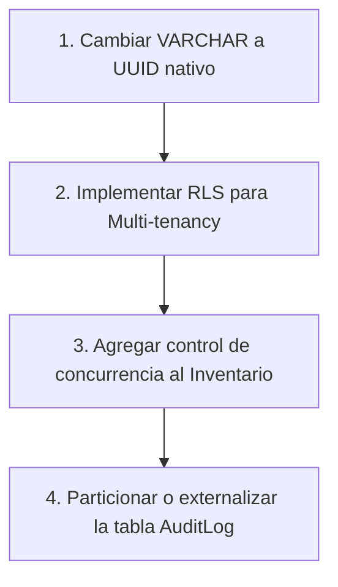

# Plan de Mitigación y Buenas Prácticas de Base de Datos (PostgreSQL)

Este documento detalla el plan de acción técnico para corregir cuellos de botella de rendimiento, escala y seguridad en la base de datos de LUCA Health OS antes del pase a producción. Está diseñado para que tu desarrollador backend lo ejecute de manera secuencial.

---

## 🚀 Resumen del Plan (Quick Path)

Para garantizar un sistema estable, seguro (HIPAA/GDPR compliant) y con alta capacidad de escala, el backend debe aplicar estas 4 mejoras estructurales:



1. **Migración de tipos**: Refactorizar llaves primarias y foráneas de `VARCHAR` a `UUID` nativo.
2. **Seguridad RLS**: Configurar políticas de seguridad por fila (Row Level Security) en PostgreSQL.
3. **Concurrencia**: Agregar columna de versión (`version INT`) a `PharmacyInventory` para evitar venta doble.
4. **Particionado de logs**: Dividir la tabla `AuditLog` por mes o derivarla a un almacenamiento frío.

---

## 📋 Detalle de Propuestas y Decisiones

### 1. Claves Primarias y Foráneas (UUID vs VARCHAR)

* **Problema**: `database.md` usa `VARCHAR` para llaves primarias que almacenan UUID v7. Esto gasta 37+ bytes por registro y ralentiza los `JOIN` e índices en consultas complejas.
* **Propuesta**: Utilizar el tipo nativo `UUID` de PostgreSQL (16 bytes binarios fijos).

#### Código de Ejemplo (SQL):
```sql
-- Ejemplo de refactor en la tabla PatientAccount
CREATE TABLE PatientAccount (
  id           UUID PRIMARY KEY DEFAULT gen_random_uuid(), -- O UUIDv7 generado por backend
  phone        VARCHAR NOT NULL UNIQUE,
  email        VARCHAR UNIQUE,
  passwordHash VARCHAR NULL,
  fullName     VARCHAR NOT NULL,
  nationalId   VARCHAR UNIQUE,
  username     VARCHAR UNIQUE,
  createdAt    TIMESTAMP DEFAULT NOW()
);
```

---

### 2. Aislamiento de Clínicas y Farmacias (Row Level Security - RLS)

* **Problema**: En un modelo multi-inquilino (multi-tenant) donde compiten clínicas y farmacias distintas, un simple bug en las queries del backend (NestJS/Express) podría exponer datos de pacientes ajenos.
* **Propuesta**: Implementar RLS a nivel de base de datos PostgreSQL. La DB rechazará lecturas no autorizadas incluso si la API falla.

#### Código de Ejemplo (SQL):
```sql
-- 1. Activar RLS en la tabla de pacientes
ALTER TABLE Patient ENABLE ROW LEVEL SECURITY;

-- 2. Crear la política de lectura para doctores de la misma clínica o dueños directos
CREATE POLICY patient_isolation_policy ON Patient
  USING (
    userId = current_setting('app.current_user_id', true)
    OR 
    clinicId IN (
      SELECT clinicId FROM ClinicMember 
      WHERE userId = current_setting('app.current_user_id', true) AND isActive = true
    )
  );
```
> [!NOTE]
> El backend deberá ejecutar `SET LOCAL app.current_user_id = 'uuid-del-usuario';` al inicio de cada transacción.

---

### 3. Evitar Venta sin Stock (Concurrencia en Inventario)

* **Problema**: En el marketplace de farmacias, si dos pacientes compran la última caja de Amoxicilina al mismo tiempo, el inventario puede quedar en `-1` o dar un falso positivo (condición de carrera).
* **Propuesta**: Utilizar **Concurrencia Optimista** en las actualizaciones de stock en la tabla `PharmacyInventory`.

#### Código de Ejemplo (SQL & Lógica de API):
```sql
-- Agregar columna de control a PharmacyInventory
ALTER TABLE PharmacyInventory ADD COLUMN version INT DEFAULT 1;

-- Query de actualización en el backend (Optimistic Lock)
UPDATE PharmacyInventory
SET stock = stock - :quantityToBuy,
    version = version + 1
WHERE id = :inventoryId 
  AND version = :currentVersion -- Valida que nadie lo haya modificado en el medio
  AND stock >= :quantityToBuy; -- Evita stock negativo
```
> [!TIP]
> Si la query devuelve `0` filas afectadas, significa que otro usuario compró antes. El backend debe reintentar la transacción o avisar al paciente que no hay stock disponible.

---

### 4. Escalado de Auditoría (AuditLog)

* **Problema**: Para el cumplimiento de leyes médicas, cada lectura (`VIEW`) de ficha de paciente genera una fila en `AuditLog`. Esta tabla alcanzará millones de filas rápidamente, degradando el rendimiento de las operaciones cotidianas.
* **Propuesta**: **Particionado mensual** de la tabla o redireccionamiento a un sistema de búsqueda externo.

#### Opción A: Particionado Nativo de Postgres (por tiempo)
```sql
-- Crear tabla padre particionada
CREATE TABLE AuditLog (
  id           UUID NOT NULL,
  userId       UUID,
  patientId    UUID,
  action       VARCHAR NOT NULL,
  createdAt    TIMESTAMP NOT NULL DEFAULT NOW(),
  PRIMARY KEY (id, createdAt) -- La clave de particionado debe ser parte de la PK
) PARTITION BY RANGE (createdAt);

-- Ejemplo de creación de partición mensual para Julio 2026
CREATE TABLE audit_log_y2026m07 PARTITION OF AuditLog
  FOR VALUES FROM ('2026-07-01 00:00:00') TO ('2026-08-01 00:00:00');
```

#### Opción B: Externalizar (Recomendada para alta escala)
En lugar de escribir en PostgreSQL, el backend escribe los logs de auditoría asincrónicamente en un servicio especializado (AWS CloudWatch, Elasticsearch o ClickHouse). Esto mantiene la base de datos PostgreSQL limpia y veloz.

---

## 📝 Checklist de Implementación para el Backend

- [ ] Cambiar llaves primarias/foráneas de `VARCHAR` a `UUID` en todos los archivos `.sql` y scripts de migración.
- [ ] Implementar middleware de base de datos en el backend para inyectar el ID de usuario activo en variables de sesión de Postgres (para RLS).
- [ ] Modificar las consultas de actualización de stock en el controlador de farmacia para usar bloqueo optimista o `SELECT FOR UPDATE` (bloqueo pesimista).
- [ ] Decidir si el almacenamiento de auditoría (`AuditLog`) se hará mediante particionamiento mensual en Postgres o mediante un microservicio de log externo.
